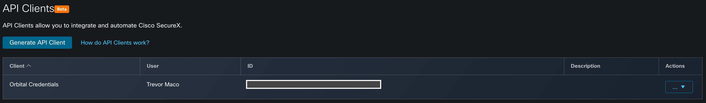
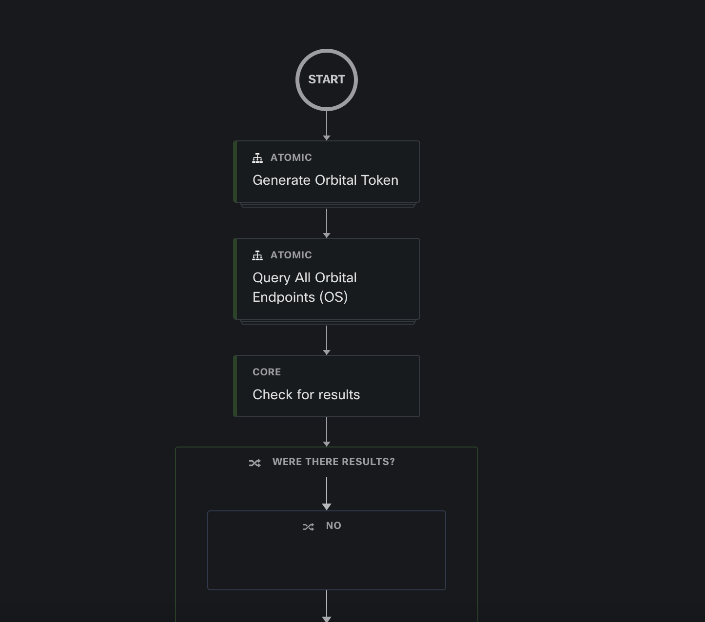
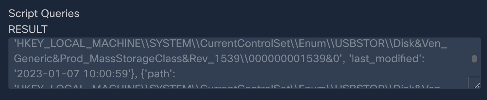
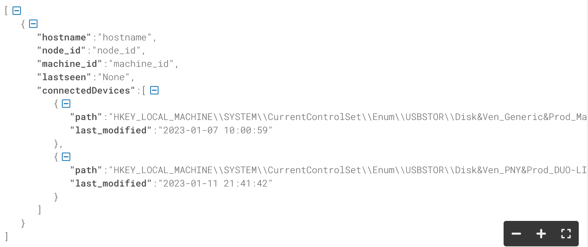

# GVE DevNet SecureX Orchestration: Orbital USB Query

This SecureX Orchestration (SXO) workflow uses Cisco Orbital to query Windows devices for information about connected usb's. The Orbital query is: windows_connected_usb_monitoring. Results are returned in a JSON string.

## Contacts
* Trevor Maco

## Solution Components
* SecureX

## Prerequisites
### Orbital API Credentials
1. In order for the Orbital API calls in this workflow to function, an Orbital API Client must be created through SecureX as described [here](https://docs.securex.security.cisco.com/SecureX-Help/Content/settings-api-clients.html)
   1. Provide a Name
   2. Select the `Orbital` Scope
   
2. Take Note of the `Client Id` and `Client Password`, as these will be used in a SXO Account Key

## Installation/Configuration
1. Clone this repository with `git clone https://github.com/gve-sw/gve_devnet_securex_orbital_usb_query`
2. Import the workflow into SXO by following this [guide](https://ciscosecurity.github.io/sxo-05-security-workflows/importing#importing-from-text-or-a-file) and using the included `sxo_usb_query_workflow.json` file.
3. Create/modify the following `Account Keys` and `Targets`. **Note**: Names are case-sensitive!

### Account Keys
* Orbital_Credentials
  * Type: HTTP Basic Authentication
  * Username: `Client Id` from API Client
  * Password: `Client Password` from API Client
  * Authentication Option: Basic
  
### Targets
* Orbital_For_Access_Token
  * Type: HTTP Endpoint
  * Account Keys:
    * Default Account Keys: Orbital_Credentials
  * HTTP
    * Protocol: HTTPS
    * Host/IPAddress: orbital.amp.cisco.com
    * Port: 443
    * Path: /v0
  * Ignore Proxy: True

* Orbital_Target
  * Type: HTTP Endpoint
  * Account Keys: None
  * HTTP
    * Protocol: HTTPS
    * Host/IPAddress: orbital.amp.cisco.com
    * Port: 443
    * Path: /v0
  * Ignore Proxy: True

4. (Optional) Modify `Orbital Query Wait Time (Minutes)` variable to increase the time the SXO workflow waits for endpoint responses (default value: 2 minutes)

## Usage
To run this SXO workflow, click `Run` (**Note**: if `Run` is greyed out, click `Validate` first)

After a few minutes, you will see a `Success` indicator:

The JSON Results are found under the Python `Format Output Data` block in the _Script Queries > RESULT_ section:

With formatting applied:

# Screenshots

### LICENSE

Provided under Cisco Sample Code License, for details see [LICENSE](LICENSE.md)

### CODE_OF_CONDUCT

Our code of conduct is available [here](CODE_OF_CONDUCT.md)

### CONTRIBUTING

See our contributing guidelines [here](CONTRIBUTING.md)

#### DISCLAIMER:
<b>Please note:</b> This script is meant for demo purposes only. All tools/ scripts in this repo are released for use "AS IS" without any warranties of any kind, including, but not limited to their installation, use, or performance. Any use of these scripts and tools is at your own risk. There is no guarantee that they have been through thorough testing in a comparable environment and we are not responsible for any damage or data loss incurred with their use.
You are responsible for reviewing and testing any scripts you run thoroughly before use in any non-testing environment.